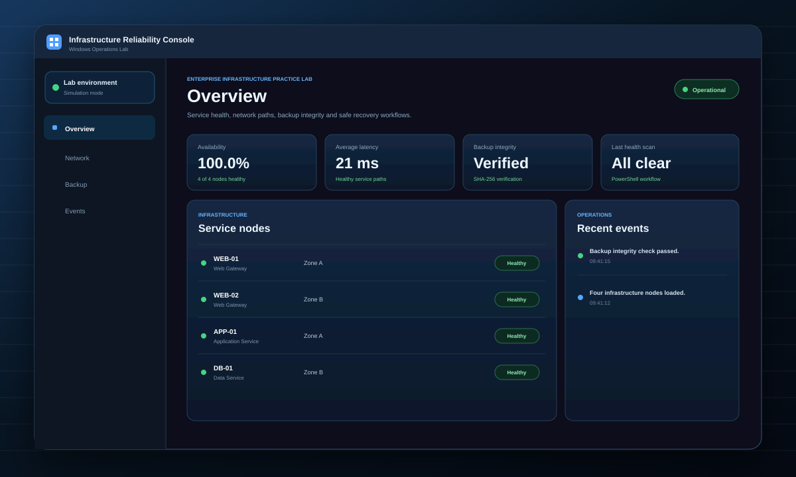

# Windows Infrastructure Reliability Console

A Windows-focused infrastructure engineering portfolio project that combines a polished React operations console with practical PowerShell automation for health checks, network visibility, backup integrity, and safe failover simulation.

The project is designed around high-reliability hosting principles: detect issues quickly, preserve evidence, verify recovery paths, automate repeatable checks, and be explicit about what is simulated versus what changes real infrastructure.

## Why this project

The target infrastructure role emphasizes enterprise hosting, Infrastructure as Code, Security, Network, Network Services, DevOps, Cloud, SAN and Backup, Virtualization, and Windows. This project focuses on a gap not covered as directly by my other portfolio work: Windows-oriented operations and recovery automation.

## Project preview

## What it demonstrates

- Windows and PowerShell operations automation
- structured infrastructure inventory
- node health and utilization checks
- DNS and TCP service metadata
- backup-age checks
- SHA-256 backup integrity verification
- safe failover simulation between redundant nodes
- operational event evidence
- incident and recovery thinking
- React-based operator dashboard
- Windows GitHub Actions validation

## Architecture

~~~text
Infrastructure inventory (JSON)
          |
          v
PowerShell reliability engine
  |          |          |
  v          v          v
Health     Backup     Failover
checks     hashes     simulation
  \          |          /
   \         |         /
      Operator evidence
             |
             v
 React Reliability Console
~~~

## Repository structure

~~~text
data/infrastructure.json
docs/incident-runbook.md
public/windows-reliability-console.svg
scripts/InfrastructureLab.ps1
src/App.jsx
src/App.css
src/index.css
tests/Run-Tests.ps1
.github/workflows/ci.yml
~~~

## Run the dashboard

Requirements:

- Node.js 18 or newer
- npm

~~~bash
npm ci
npm run dev
~~~

For a production build:

~~~bash
npm run build
~~~

## Run the PowerShell health scan

~~~powershell
pwsh -NoProfile -File ./scripts/InfrastructureLab.ps1 -Mode Health -InputFile ./data/infrastructure.json
~~~

The script evaluates node status, CPU, memory, and backup age and returns structured JSON.

## Verify backup integrity

~~~powershell
pwsh -NoProfile -File ./scripts/InfrastructureLab.ps1 -Mode Backup -SourcePath ./sample/source.txt -BackupPath ./sample/backup.txt
~~~

The source and backup SHA-256 hashes must match before IntegrityVerified is reported as true.

## Run the failover simulation

~~~powershell
pwsh -NoProfile -File ./scripts/InfrastructureLab.ps1 -Mode Failover -InputFile ./data/infrastructure.json -FailedNode WEB-01
~~~

The script selects a healthy redundant node with the same role and reports the proposed recovery target.

No DNS record, load balancer, Windows service, or production system is changed.

## Automated validation

GitHub Actions runs on windows-latest and performs:

1. npm ci
2. React production build
3. infrastructure health validation
4. backup integrity validation
5. failover simulation validation

Local automation tests:

~~~powershell
pwsh -NoProfile -File ./tests/Run-Tests.ps1
~~~

## Reliability and security decisions

**Structured configuration:** infrastructure state lives in JSON rather than being scattered through scripts.

**Evidence-friendly output:** automation returns JSON that can be logged, parsed, or forwarded to another workflow.

**Safe simulation:** failover demonstrates decision logic without making unauthorized infrastructure changes.

**Backup verification:** a backup is not treated as trusted merely because a copy exists. Content integrity is checked.

**Explicit thresholds:** CPU, memory, and backup-age thresholds can be changed without rewriting the core logic.

## Incident workflow

The included runbook follows a simple sequence:

1. Detect
2. Confirm impact
3. Preserve evidence
4. Escalate
5. Recover using an approved action
6. Verify service restoration
7. Document root cause and follow-up

## Production improvements

A production implementation would add:

- Active Directory integration
- least-privilege service accounts
- Windows Event Log collection
- centralized monitoring and alert routing
- secrets management
- certificate-based remote management
- real load balancer or DNS integrations
- redundant storage and tested restoration
- patch and vulnerability management
- network segmentation
- configuration management
- formal change control
- multi-site disaster recovery
- audit retention and RBAC

## Skills demonstrated

PowerShell, Windows Infrastructure, React, Network Services, DNS, TCP, Backup Verification, SHA-256, Failover, Reliability Engineering, Incident Response, Automation, GitHub Actions

## Portfolio positioning

This project keeps my software engineering foundation visible while showing how I apply programming, automation, troubleshooting, and security thinking to enterprise infrastructure.

The dashboard is a portfolio visualization. The PowerShell automation is implemented in the repository, and the project does not claim to be connected to a production healthcare environment.
